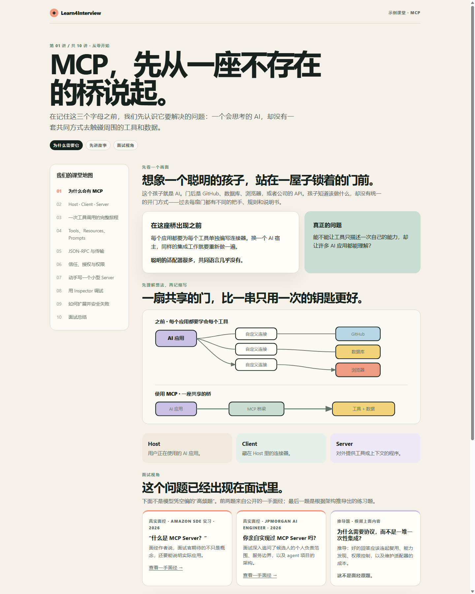

<div align="center">

# Learn4Interview

### ELI5 clarity → interview confidence

Turn any technical topic into a friendly, visual classroom that starts from zero and ends with an answer you can actually say in an interview.

<p>
  <a href="SKILL.md"></a>
  
  
  
</p>

</div>

<p align="center">
  
</p>

## 🌱 What is it?

**Learn4Interview is a teaching mode, not a topic-specific tutor.**

Give Codex or Claude Code a stack, protocol, system, or knowledge point—such as Claude Code architecture, MySQL, Redis, networking, or async programming—and it turns the subject into a connected series of lessons.

The teaching starts with a story a five-year-old could follow, then quietly builds toward real implementations, architecture trade-offs, and interview-ready explanations.

## ✨ Why it feels different

| 🧸 Five-year-old clarity | 🔎 Real interview evidence | 🏫 Classroom progression | 🌈 Friendly HTML |
| --- | --- | --- | --- |
| Problem before terminology. Intuition before jargon. | Research real first-hand interview reports and keep guesses clearly labeled. | Learn one lesson at a time. Follow-up questions deepen the current lesson instead of derailing the course. | Every formal lesson becomes a warm, visual, responsive page that is easy to read, share, and revisit. |

<p align="center">
  <strong>Not an endless textbook.</strong><br>
  A difficult topic becomes a sequence of small “oh, I get it” moments—then a clear answer under interview pressure.
</p>

## 🧪 Example · MCP

This is a real first lesson generated with Learn4Interview—not a mock screenshot. It starts with a five-year-old-friendly story, reveals the MCP vocabulary only after the idea is clear, then connects it to an architecture diagram and public interview evidence.

<p align="center">
  <a href="examples/mcp/lecture-01.html">
    
  </a>
</p>

<p align="center">
  <a href="examples/mcp/lecture-01.html"><strong>Open the full MCP lesson →</strong></a>
</p>

<p align="center"><sub>Official MCP documentation · Amazon SDE interview report · JPMorgan AI Engineer interview report</sub></p>

## 📦 Install

Give this repository URL to an agent that supports skills:

<p align="center">
  <a href="https://github.com/SlamWeb/Learn4Interview"><strong>https://github.com/SlamWeb/Learn4Interview</strong></a>
</p>

For example, tell Codex or Claude Code:

```text
Install this skill:
https://github.com/SlamWeb/Learn4Interview
```

Then start a class:

```text
Use $learn4interview to teach me Claude Code architecture from zero for interviews.
```

<div align="center">

**One topic in. One friendly classroom. Interview-ready out.**

</div>
